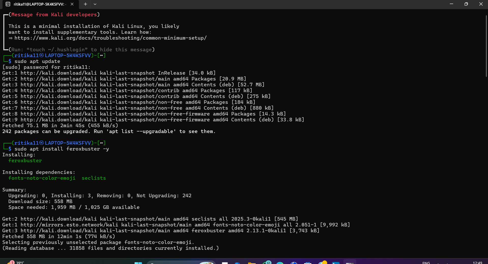
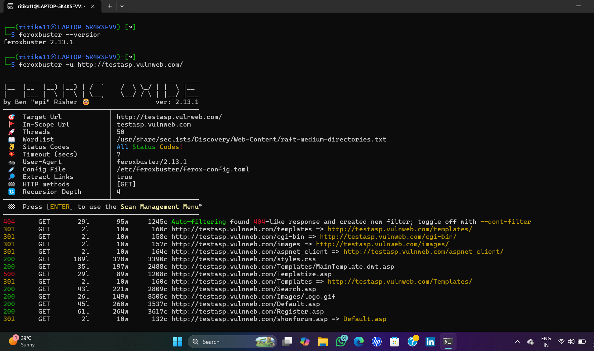
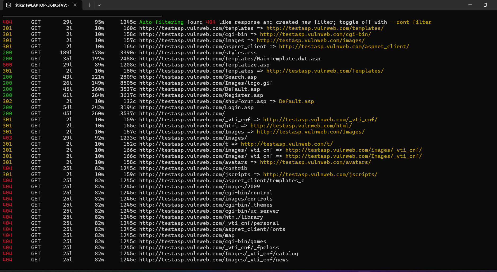

# Hidden Directory Enumeration using Feroxbuster

A cybersecurity project demonstrating web content discovery using Feroxbuster to identify hidden directories and files on a target web application.

---

## Objective

The objective of this project is to perform directory enumeration on a web application, discover hidden resources, and understand how attackers and security professionals identify accessible directories during reconnaissance.

---

## Tools Used

- Kali Linux
- Feroxbuster
- TestASP Vulnerable Web Application

---

## Target

http://testasp.vulnweb.com/

---

## Commands Used

```bash
sudo apt update

sudo apt install feroxbuster -y

feroxbuster --version

feroxbuster -u http://testasp.vulnweb.com/
```

## Project Screenshots

### Feroxbuster Installation



### Directory Scan Started



### Hidden Directories Discovered



## Project Outcome

- Successfully installed Feroxbuster on Kali Linux.
- Performed web directory enumeration on the target website.
- Identified multiple hidden directories and files.
- Observed different HTTP response status codes.
- Learned basic web content discovery techniques.
- Improved understanding of reconnaissance during penetration testing.

## Disclaimer

This project was performed only in a controlled environment for educational and ethical cybersecurity learning purposes.
